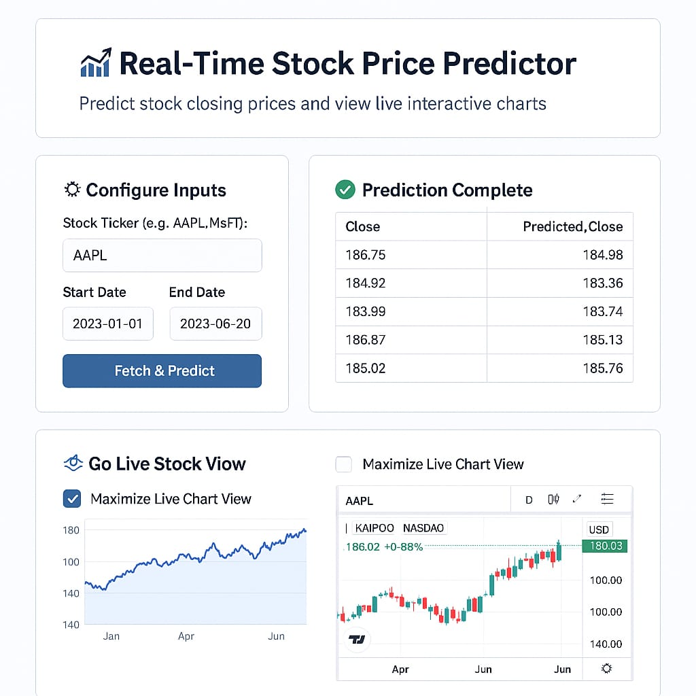

## 📈 Real-Time Stock Price Prediction Dashboard

This project is a Streamlit-powered web dashboard that provides real-time stock price prediction using historical market data. It leverages machine learning (Linear Regression) trained on features such as Open, High, Low, Volume, and visualizes both actual and predicted closing prices. It also integrates a live TradingView chart for an interactive market view.

## 🔧 Tech Stack
Layer	Tool/Library
Language	Python 3.9+  
UI	Streamlit  
ML Model	Scikit-learn (Linear Regression)  
Data Source	Yahoo Finance via yfinance  
Deployment	Docker + Azure App Service  
Visualization	TradingView embedded widget  
Version Control	Git + GitHub  

## 📁 Project Structure

<pre>stock_prediction_dashboard/
│
├── app.py                         # Streamlit UI
├── train_model.py                # Script to train and save the ML model
├── requirements.txt              # Python dependencies
├── Dockerfile                    # For containerizing the app
├── models/
│   └── stock_price_model.pkl     # Trained ML model
├── utils/
│   ├── fetch_data.py             # Pulls data using yfinance
│   └── prediction.py             # Prepares features and predicts values
└── assets/
    └── output_structure.png      # Output sample or project flow diagram</pre>
## ⚙️ How to Run Locally
### 1. Clone the Repo
```
git clone https://github.com/VMREDDY003/stock_prediction_dashboard.git
cd stock_prediction_dashboard
```
### 2. Create Virtual Environment
```
python -m venv venv
venv\Scripts\activate       # On Windows
```
### 3. Install Requirements
```
pip install -r requirements.txt
```
### 4. Train the Model
```
python train_model.py
```
### 5. Run the Streamlit App
```
streamlit run app.py
```
## ☁️ Azure Cloud Deployment (Docker + App Service)
### ✅ Step-by-step
### 1.Install Docker Desktop and enable WSL or Hyper-V.
### 2.Build Docker Image:
```
docker build -t stock-dashboard .
```
### 3.Test Locally:
```
docker run -p 8501:8501 stock-dashboard
```
### 4.Push Image to Azure Container Registry (ACR):
- Create ACR in Azure Portal
- Authenticate and push:
```
docker tag stock-dashboard <your-acr>.azurecr.io/stock-dashboard
docker push <your-acr>.azurecr.io/stock-dashboard
```
5.Deploy to Azure App Service:
- Create an App Service with Docker
- Use your ACR image as source
- Set port 8501
✅ Now your Streamlit app is live on Azure!

## 🔐 Licensing / Legal Safety
This project:

- Uses publicly available APIs (Yahoo Finance via yfinance)

- Uses open-source libraries (Streamlit, scikit-learn, pandas)

- Does not scrape or violate any proprietary trading data

- Embeds legal TradingView iframe, not storing/processing that data

➡️ It is safe for public, academic, or job portfolio use.

## 🚀 Future Features
- Add user authentication
- Include multiple ML models (XGBoost, LSTM)
- Database integration for logging predictions
- Add more interactivity in charts

